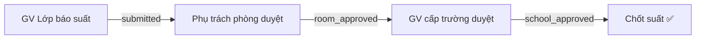

# Kế hoạch: Thêm tầng "Lớp học" & Quy trình Duyệt mới

## Tổng quan

Thay đổi hệ thống phân cấp từ **Nhóm → Phòng** sang **Nhóm → Phòng → Lớp**, đồng thời cập nhật quy trình duyệt báo cáo suất ăn theo 3 cấp.

## User Review Required

> [!IMPORTANT]
> **Thay đổi cấu trúc Database lớn**: Cần tạo bảng mới `classes`, thêm cột `class_id` vào `daily_reports`, và thay đổi role system. Dữ liệu hiện tại (`daily_reports` cũ) sẽ cần migrate.

> [!WARNING]
> **Đổi tên Role**: `room_manager` → `room_manager` (phụ trách phòng), thêm `class_teacher` (giáo viên lớp), `group_manager` giữ nguyên nhưng trở thành "GV cấp trường". Cần confirm tên role chính xác.

---

## Phân cấp mới

```
TRƯỜNG (toàn hệ thống)
  └── Nhóm (groups) — VD: Khối 1, Khối 2
        └── Phòng (rooms) — VD: Phòng B31
              └── Lớp (classes) — VD: Lớp 1A, Lớp 1B
```

## Phân quyền mới

| Role | Tên hiển thị | Chức năng |
|------|-------------|-----------|
| `admin` | Quản trị viên | Toàn quyền, cài đặt hệ thống |
| `school_approver` | GV cấp trường | Duyệt phòng/nhóm/toàn trường |
| `room_manager` | Phụ trách phòng | Duyệt số liệu các lớp trong phòng |
| `class_teacher` | Giáo viên lớp | Báo suất ăn cho lớp mình |
| `kitchen` | Bếp / Kế toán | Xem tổng hợp |

## Luồng duyệt 3 cấp



1. **GV Lớp** → Nhập: số HS cắt suất, phần chay, phần cháo, danh sách HS cắt suất → Bấm **Gửi**
2. **Phụ trách phòng** → Xem tất cả lớp trong phòng → Bấm **Duyệt phòng** → Trạng thái = `room_approved`. Hiển thị trạng thái "Cấp trường: Duyệt/Chưa duyệt"
3. **GV cấp trường** → Xem từng nhóm → Duyệt từng phòng hoặc bấm **Duyệt toàn Nhóm** / **Duyệt toàn Trường** (có confirm dialog) → Trạng thái = `school_approved`

> Nguyên tắc: Quá giờ chốt suất → không ai sửa được (trừ Admin ghi đè).

---

## Proposed Changes

### Giai đoạn 1: Database & Backend

#### [NEW] [migration_classes.sql](file:///d:/2.%20HYMINH/PHẦN%20MỀM/DAT-SUAT-BAN-TRU/ban-tru/supabase/migration_classes.sql)

Tạo bảng `classes` mới:
```sql
CREATE TABLE public.classes (
  id UUID DEFAULT gen_random_uuid() PRIMARY KEY,
  name TEXT NOT NULL,
  room_id UUID NOT NULL REFERENCES public.rooms(id) ON DELETE CASCADE,
  default_capacity INTEGER NOT NULL DEFAULT 0,
  created_at TIMESTAMPTZ DEFAULT now()
);
```

Thay đổi `profiles`:
- Thêm role `class_teacher`, `school_approver` vào CHECK constraint
- Thêm cột `class_id UUID REFERENCES classes(id)`

Thay đổi `daily_reports`:
- Thêm cột `class_id UUID REFERENCES classes(id)` (báo cáo theo lớp thay vì phòng)
- Thêm status mới: `room_approved`, `school_approved`
- Unique constraint đổi thành [(class_id, report_date)](file:///d:/2.%20HYMINH/PH%E1%BA%A6N%20M%E1%BB%80M/DAT-SUAT-BAN-TRU/ban-tru/src/app/dashboard/room/actions.ts#123-124) hoặc [(room_id, class_id, report_date)](file:///d:/2.%20HYMINH/PH%E1%BA%A6N%20M%E1%BB%80M/DAT-SUAT-BAN-TRU/ban-tru/src/app/dashboard/room/actions.ts#123-124)

RLS policies mới cho `classes`.

---

### Giai đoạn 2: Cài đặt (Settings)

#### [MODIFY] [page.tsx](file:///d:/2.%20HYMINH/PHẦN%20MỀM/DAT-SUAT-BAN-TRU/ban-tru/src/app/dashboard/settings/page.tsx)
- Thêm Tab **"Lớp học"** trong Settings
- Cho phép: Tạo/Sửa/Xóa lớp thuộc phòng, Import Excel danh sách lớp
- Hiển thị: Nhóm → Phòng → Lớp (dạng accordion/tree)

#### [MODIFY] [actions.ts](file:///d:/2.%20HYMINH/PHẦN%20MỀM/DAT-SUAT-BAN-TRU/ban-tru/src/app/dashboard/settings/actions.ts)
- Thêm CRUD cho `classes`: `getClasses()`, `createClass()`, `updateClass()`, `deleteClass()`
- Thêm `importClassesFromExcel()` (parse Excel file trên server)

---

### Giai đoạn 3: Trang GV Lớp (Báo suất)

#### [MODIFY] [room/page.tsx](file:///d:/2.%20HYMINH/PHẦN%20MỀM/DAT-SUAT-BAN-TRU/ban-tru/src/app/dashboard/room/page.tsx)
- Đổi thành trang cho `class_teacher`
- Lấy lớp từ `profile.class_id` thay vì `profile.room_id`
- Giữ nguyên form nhập liệu (sĩ số, cắt suất, cháo, chay, danh sách HS)

#### [MODIFY] [room/actions.ts](file:///d:/2.%20HYMINH/PHẦN%20MỀM/DAT-SUAT-BAN-TRU/ban-tru/src/app/dashboard/room/actions.ts)
- [getRoomData()](file:///d:/2.%20HYMINH/PH%E1%BA%A6N%20M%E1%BB%80M/DAT-SUAT-BAN-TRU/ban-tru/src/app/dashboard/room/actions.ts#261-314) → `getClassData()`: lấy dữ liệu theo `class_id`
- [submitReport()](file:///d:/2.%20HYMINH/PH%E1%BA%A6N%20M%E1%BB%80M/DAT-SUAT-BAN-TRU/ban-tru/src/app/dashboard/room/actions.ts#134-260): tạo báo cáo theo `class_id`

---

### Giai đoạn 4: Trang Phụ trách phòng (Duyệt phòng)

#### [MODIFY] [group/page.tsx](file:///d:/2.%20HYMINH/PHẦN%20MỀM/DAT-SUAT-BAN-TRU/ban-tru/src/app/dashboard/group/page.tsx)
- Đổi thành trang cho `room_manager`
- Hiển thị tất cả lớp trong phòng mình + trạng thái báo cáo
- Nút **"Duyệt phòng"** → chuyển tất cả báo cáo `submitted` → `room_approved`
- Hiển thị trạng thái "Cấp trường: ✅ Đã duyệt / ⏳ Chưa duyệt"

---

### Giai đoạn 5: Trang GV cấp trường (Duyệt trường)

#### [NEW] [school/page.tsx](file:///d:/2.%20HYMINH/PHẦN%20MỀM/DAT-SUAT-BAN-TRU/ban-tru/src/app/dashboard/school/page.tsx)
- Hiển thị tất cả Nhóm → Phòng → Tổng hợp số liệu
- Mỗi phòng có nút **"Duyệt phòng"**
- Mỗi nhóm có nút **"Duyệt toàn Nhóm"** (confirm: "Bạn có chắc duyệt tất cả phòng trong nhóm X?")
- Nút **"Duyệt toàn Trường"** (confirm: "Bạn có chắc duyệt toàn bộ trường?")
- Chuyển status `room_approved` → `school_approved`

#### [NEW] [school/actions.ts](file:///d:/2.%20HYMINH/PHẦN%20MỀM/DAT-SUAT-BAN-TRU/ban-tru/src/app/dashboard/school/actions.ts)
- `getSchoolReports()`: lấy tất cả báo cáo nhóm theo nhóm
- `approveRoom()`, `approveGroup()`, `approveSchool()`

---

### Giai đoạn 6: NavBar & Layout

#### [MODIFY] [NavBar.tsx](file:///d:/2.%20HYMINH/PHẦN%20MỀM/DAT-SUAT-BAN-TRU/ban-tru/src/components/layout/NavBar.tsx)
- Thêm nav item cho `school_approver` → `/dashboard/school`
- Cập nhật roles cho các nav items hiện tại

#### [MODIFY] [login/actions.ts](file:///d:/2.%20HYMINH/PHẦN%20MỀM/DAT-SUAT-BAN-TRU/ban-tru/src/app/(auth)/login/actions.ts)
- Thêm redirect cho `class_teacher` và `school_approver`

---

## Thứ tự thực hiện

| Bước | Giai đoạn | Mô tả |
|------|-----------|-------|
| 1 | DB Migration | Tạo bảng `classes`, sửa `profiles`, `daily_reports`, RLS |
| 2 | Settings | Thêm tab Lớp học + Import Excel |
| 3 | GV Lớp | Sửa trang báo suất theo lớp |
| 4 | PT Phòng | Sửa trang duyệt phòng |
| 5 | GV Trường | Tạo trang duyệt cấp trường |
| 6 | NavBar + Auth | Cập nhật điều hướng |

## Verification Plan

### Automated Tests
- Chạy `npm run build` để kiểm tra TypeScript không có lỗi
- Test trên `localhost:3000` với các tài khoản khác nhau

### Manual Verification
- Tạo dữ liệu mẫu: 2 nhóm, 3 phòng, 5 lớp
- Đăng nhập bằng `class_teacher` → báo suất → kiểm tra submit
- Đăng nhập bằng `room_manager` → duyệt phòng → kiểm tra status
- Đăng nhập bằng `school_approver` → duyệt nhóm/trường → kiểm tra status
- Test quá giờ chốt suất → không sửa được
