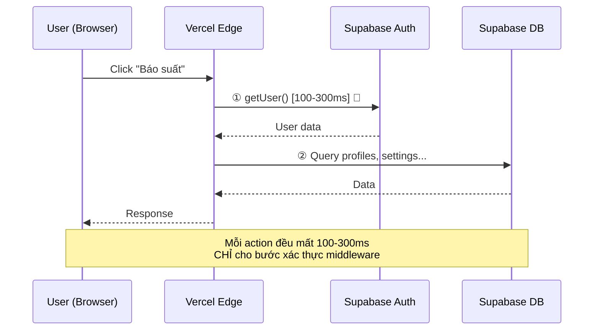
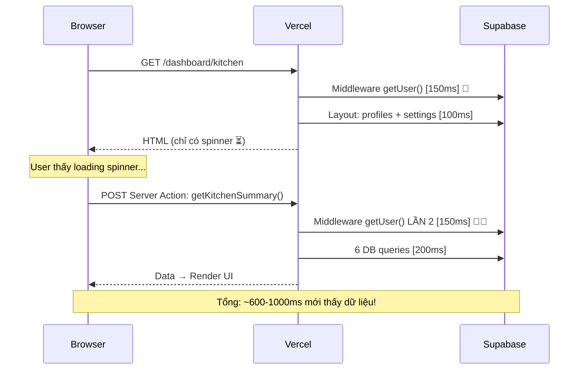

# 🔍 Phân Tích Nguyên Nhân Hệ Thống Chậm

## Tóm Tắt: Chậm Do Đâu?

| Nguyên nhân | Mức ảnh hưởng | Thuộc về |
|---|---|---|
| ① Middleware gọi `getUser()` mỗi request | 🔴 **Rất lớn** (+100-300ms/request) | Code |
| ② Kiến trúc client-side → waterfall kép | 🔴 **Rất lớn** (+300-800ms) | Code |
| ③ Không có caching cho settings | 🟠 **Lớn** (+50-150ms/page) | Code |
| ④ Query trùng lặp (profiles, settings) | 🟠 **Lớn** (+100-300ms/page) | Code |
| ⑤ Realtime trigger full re-fetch | 🟡 **Trung bình** (burst giờ cao điểm) | Code |
| ⑥ Vercel cold start + khoảng cách địa lý | 🟡 **Trung bình** (+200-500ms lần đầu) | Hạ tầng |
| ⑦ JS aggregation thay vì SQL | 🟡 **Nhẹ** (khi data lớn) | Code |

> [!CAUTION]
> **Kết luận: ~70% do code, ~30% do hạ tầng (Vercel/Supabase).**
> Chuyển lên VPS sẽ giúp cải thiện phần hạ tầng, nhưng **nếu không sửa code thì vẫn chậm**.

---

## ① Middleware Gọi `getUser()` Mỗi Request — NGUYÊN NHÂN LỚN NHẤT

### Vấn đề
File [middleware.ts](file:///D:/2.%20HYMINH/PHẦN%20MỀM/DAT-SUAT-BAN-TRU/ban-tru/src/lib/supabase/middleware.ts) chạy `await supabase.auth.getUser()` trên **MỌI request** — bao gồm cả navigation, Server Action, RSC request.

```
getUser() = Gọi HTTPS tới Supabase Auth server (/auth/v1/user)
           = 100 - 300ms mỗi lần (tùy mạng)
```

### Tại sao nghiêm trọng?
Mỗi khi user **click bất kỳ nút nào**, gọi bất kỳ Server Action nào, request đều đi qua middleware → thêm 100-300ms trước khi logic thực thi.



---

## ② Kiến Trúc Client-Side Gây Waterfall Kép

### Vấn đề
Tất cả trang chính (`kitchen`, `room`, `reports`) đều là `'use client'` component. Quy trình tải trang:



### Waterfall chi tiết cho trang Kitchen:
| Bước | Hành động | Thời gian |
|---|---|---|
| 1 | Middleware `getUser()` (lần 1) | ~150ms |
| 2 | Layout query `profiles` + `settings` | ~100ms |
| 3 | Gửi HTML skeleton về browser | ~50ms |
| 4 | Browser mount → gọi Server Action | ~50ms |
| 5 | Middleware `getUser()` (lần 2!) | ~150ms 🔴 |
| 6 | `getKitchenSummary()`: 6 DB queries | ~200ms |
| **Tổng** | | **~700ms** |

> Nếu dùng Server Component để fetch data ngay trong SSR, bỏ được bước 4-5, tiết kiệm **~200-400ms**.

---

## ③ Không Có Caching Hiệu Quả

### Vấn đề
- [cachedSettings.ts](file:///D:/2.%20HYMINH/PHẦN%20MỀM/DAT-SUAT-BAN-TRU/ban-tru/src/lib/cachedSettings.ts) dùng `React.cache()` — chỉ cache trong **1 request duy nhất**, không cache giữa các request
- `cachedSettings` chỉ được dùng trong `reports/actions.ts`. Các file khác (`kitchen/actions.ts`, `room/actions.ts`, `layout.tsx`) đều query `settings` trực tiếp mỗi lần
- **Tên trường, địa chỉ trường, giờ chốt mốc** — những thứ gần như không bao giờ thay đổi — bị query lại mỗi request

### Ví dụ lãng phí trong `kitchen/actions.ts`:
```
Dòng 17-20: supabase.from('settings').select('key, value').in(...)  ← Lần 1
Dòng 81:    supabase.from('settings').select('*')                   ← Lần 2 (TRÙNG!)
```

---

## ④ Query Trùng Lặp — Profiles Bị Query 4 Lần!

Trong **1 lần user vào trang `/dashboard/room`**:

| Lần | Nơi gọi | Query |
|---|---|---|
| 1 | Middleware | `profiles.select('role')` (nếu cookie hết hạn) |
| 2 | `layout.tsx` | `profiles.select('full_name, role')` |
| 3 | `getRoomData()` | `profiles.select('room_id, class_id')` |
| 4 | `submitReport()` | `profiles.select('role, room_id, class_id')` |

→ **4 lần query cùng 1 row profiles** cho cùng 1 user!

---

## ⑤ Realtime Trigger Full Re-fetch

### Vấn đề
Khi có bất kỳ thay đổi nào trên bảng `daily_reports`:
1. `useRealtimeRefresh` nhận event (không filter theo room/group)
2. Gọi `loadData()` → trigger `getKitchenSummary()` → **6 DB queries lại từ đầu**
3. Nếu 30 giáo viên báo suất trong khoảng 7:00-8:00 sáng → hàng chục lần re-fetch toàn bộ dữ liệu

---

## ⑥ Vercel + Supabase — Vấn Đề Hạ Tầng

### Vercel Free Tier
- **Cold start**: Sau ~15 phút không có request, Serverless Function phải khởi động lại (~500ms-2s)
- **Region**: Vercel function thường chạy ở `iad1` (US East) hoặc `sin1` (Singapore), còn user ở Việt Nam
- **Execution limit**: 10 giây cho free tier

### Supabase Free Tier
- **Khoảng cách**: Supabase project thường ở Singapore/US → mỗi query thêm ~30-100ms network latency
- **Connection limit**: Free tier giới hạn concurrent connections
- **Ngủ đông**: Pause sau 7 ngày không hoạt động

### Ước tính latency mạng (Vercel ↔ Supabase ↔ User):
```
User (VN) → Vercel (Singapore): ~30-50ms
Vercel → Supabase Auth: ~20-50ms  
Vercel → Supabase DB: ~10-30ms (cùng region)
                       ~100-200ms (khác region)

Tổng 1 round-trip: ~60-300ms
× 6-8 queries/page = 360-2400ms chỉ cho network!
```

---

## ⑦ JS Aggregation Thay Vì SQL

Trong [reports/actions.ts](file:///D:/2.%20HYMINH/PHẦN%20MỀM/DAT-SUAT-BAN-TRU/ban-tru/src/app/dashboard/reports/actions.ts):
- Fetch **toàn bộ raw records** từ `daily_reports` và `teacher_meal_reports`
- Dùng `.forEach()` trong JavaScript để tính tổng
- Thay vì dùng SQL `SUM()` + `GROUP BY` trả về kết quả gọn

→ Khi data tích lũy nhiều (hàng ngàn records/tháng), sẽ ngày càng chậm.

---

## Tổng Kết: Chuyển VPS Giải Quyết Được Gì?

| Vấn đề | Chuyển VPS có fix? | Ghi chú |
|---|---|---|
| Vercel cold start | ✅ **Có** — PM2 luôn chạy | Không còn cold start |
| Khoảng cách user → server | ✅ **Có** — VPS ở VN | Giảm ~20-50ms/request |
| Middleware getUser() chậm | ⚠️ **Một phần** | Vẫn gọi Supabase Auth cloud |
| Waterfall client-side | ❌ **Không** | Cần refactor code |
| Không caching | ❌ **Không** | Cần thêm caching |
| Query trùng lặp | ❌ **Không** | Cần refactor code |
| Realtime full re-fetch | ❌ **Không** | Cần refactor code |

> [!TIP]
> **Khuyến nghị**: Chuyển VPS + Sửa code (ít nhất vấn đề ①②③) sẽ giảm thời gian tải từ **~700-1500ms xuống ~150-300ms**.
