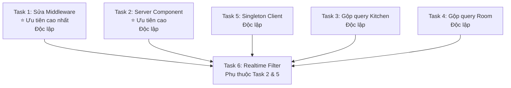

# 🚀 Yêu Cầu Fix Performance — Dự Án Bán Trú

> **Mục đích**: Tối ưu hiệu suất ứng dụng trước khi triển khai lên VPS.  
> **Ưu tiên**: Thực hiện theo thứ tự từ Task 1 → 6. Các task độc lập có thể làm song song.  
> **Lưu ý**: KHÔNG thay đổi logic nghiệp vụ, chỉ tối ưu hiệu suất.

---

## Tổng Quan Vấn Đề

Ứng dụng hiện tại tải trang mất **~700-1500ms** do:
- Middleware gọi Supabase Auth API mỗi request (+100-300ms)
- Kiến trúc `'use client'` gây waterfall kép (HTML rỗng → mount → Server Action → middleware lần 2)
- Không cache settings/profiles, query trùng lặp
- Realtime trigger full re-fetch 6+ queries

**Mục tiêu sau fix**: Tải trang **< 300ms**, giảm số lượng query từ ~8-12 xuống ~3-4 per page load.

---

## Task 1: Sửa Middleware — Bỏ `getUser()`, Dùng `getSession()` ⭐ ƯU TIÊN CAO NHẤT

### Vấn đề
File `src/lib/supabase/middleware.ts` dòng `await supabase.auth.getUser()` gọi HTTPS tới Supabase Auth server mỗi request → +100-300ms. Điều này xảy ra trên MỌI request (navigation, Server Action, RSC).

### File cần sửa
- `src/lib/supabase/middleware.ts`

### Yêu cầu
1. **Thay `getUser()` bằng `getSession()`** trong middleware:
   - `getSession()` chỉ đọc JWT token từ cookie local → gần như tức thì (0ms network)
   - `getUser()` gọi mạng tới Supabase → 100-300ms
   - Middleware chỉ cần xác định user có đăng nhập hay không và kiểm tra role → `getSession()` đủ an toàn
2. **Giữ nguyên `getUser()` ở những nơi cần bảo mật cao** (Server Actions xử lý ghi dữ liệu) — KHÔNG thay đổi trong actions
3. Logic phân quyền, redirect, cookie cache role giữ nguyên

### Code mẫu thay đổi
```typescript
// TRƯỚC (chậm):
const { data: { user } } = await supabase.auth.getUser()
if (!user) { ... }

// SAU (nhanh):
const { data: { session } } = await supabase.auth.getSession()
if (!session) { ... }
const user = session.user  // Lấy user info từ session token
```

### Tiêu chí hoàn thành
- [ ] Middleware không còn gọi `getUser()` 
- [ ] Dùng `getSession()` để kiểm tra auth và lấy user.id
- [ ] Logic phân quyền route vẫn hoạt động đúng
- [ ] Cookie cache `user-role`, `user-id` vẫn hoạt động

---

## Task 2: Chuyển Trang Dashboard Sang Server Component (Bỏ Waterfall)  ⭐ ƯU TIÊN CAO

### Vấn đề
Các trang `kitchen/page.tsx`, `room/page.tsx`, `reports/page.tsx` hiện tại đều là `'use client'`:
1. SSR trả về HTML rỗng (loading spinner)
2. Browser mount component
3. `useEffect` gọi Server Action → request đi qua middleware LẦN 2
4. Mới có dữ liệu để render

→ User phải chờ **2 round-trips** thay vì 1.

### File cần sửa
- `src/app/dashboard/kitchen/page.tsx`
- `src/app/dashboard/room/page.tsx`
- `src/app/dashboard/reports/page.tsx`

### Yêu cầu
Với **mỗi trang**, tách thành 2 phần:

1. **Server Component (page.tsx)**: Fetch dữ liệu ban đầu bằng cách gọi trực tiếp hàm action (import trực tiếp, không qua HTTP)
2. **Client Component (mới tạo)**: Nhận dữ liệu qua props, xử lý tương tác UI, Realtime refresh

### Mẫu cấu trúc cho Kitchen:

**`kitchen/page.tsx`** (Server Component — KHÔNG có `'use client'`):
```typescript
import { getKitchenSummary } from './actions'
import { KitchenClient } from './KitchenClient'

export default async function KitchenPage() {
    const initialData = await getKitchenSummary()
    return <KitchenClient initialData={initialData} />
}
```

**`kitchen/KitchenClient.tsx`** (Client Component — `'use client'`):
```typescript
'use client'

import { useState, useCallback } from 'react'
import { getKitchenSummary } from './actions'
import { useRealtimeRefresh } from '@/hooks/useRealtimeRefresh'

export function KitchenClient({ initialData }: { initialData: Awaited<ReturnType<typeof getKitchenSummary>> }) {
    const [data, setData] = useState(initialData)
    
    const loadData = useCallback(async () => {
        const newData = await getKitchenSummary()
        setData(newData)
    }, [])

    useRealtimeRefresh(['daily_reports', 'teacher_meal_reports'], loadData)

    // ... phần render UI giữ nguyên, dùng `data` thay vì state cũ
}
```

### Áp dụng tương tự cho:
- `room/page.tsx` → tách ra `room/RoomClient.tsx`
- `reports/page.tsx` → tách ra `reports/ReportsClient.tsx`

### Tiêu chí hoàn thành
- [ ] 3 file `page.tsx` đều là Server Component (không có `'use client'`)
- [ ] 3 file Client mới (`KitchenClient.tsx`, `RoomClient.tsx`, `ReportsClient.tsx`) xử lý UI + Realtime
- [ ] Khi vào trang, dữ liệu hiển thị ngay (không còn loading spinner ban đầu)
- [ ] Realtime refresh vẫn hoạt động
- [ ] Tất cả chức năng nghiệp vụ giữ nguyên

---

## Task 3: Gộp Query Trùng Lặp Trong `kitchen/actions.ts`

### Vấn đề
Trong hàm `getKitchenSummary()` tại `src/app/dashboard/kitchen/actions.ts`:
- **Dòng 17-20**: `supabase.from('settings').select('key, value').in(...)` → query settings lần 1
- **Dòng 81 (trong Promise.all)**: `supabase.from('settings').select('*')` → query settings lần 2

Hai query này lấy cùng 1 bảng `settings` nhưng chạy riêng biệt.

### File cần sửa
- `src/app/dashboard/kitchen/actions.ts`

### Yêu cầu
1. **Gộp thành 1 query duy nhất** `settings.select('*')` ngay đầu hàm
2. Dùng kết quả đó cho cả việc tính ngày LẪN việc lấy `schoolName`, `schoolAddress`
3. Loại bỏ query `settings` thừa trong `Promise.all`

### Code mẫu
```typescript
export async function getKitchenSummary(date?: string, onlyApproved: boolean = false) {
    const supabase = await createClient()
    const { userRole } = await getSessionInfo()

    // ✅ MỘT query duy nhất cho settings
    const { data: allSettings } = await supabase.from('settings').select('*')
    const get = (key: string, def: string) => allSettings?.find(s => s.key === key)?.value || def

    // Dùng allSettings cho cả logic tính ngày VÀ schoolInfo
    const moc1Close = get('moc1_close', '16:00')
    const schoolName = get('school_name', '')
    const schoolAddress = get('school_address', '')
    // ... (logic tính reportDate giữ nguyên, dùng biến `get`)

    // ✅ Promise.all KHÔNG còn query settings nữa
    const [reportsResult, groupsResult, roomsResult, teacherResult] = await Promise.all([
        query.order('created_at'),
        supabase.from('groups').select('*').order('name'),
        supabase.from('rooms').select('*, groups(name)').order('name'),
        supabase.from('teacher_meal_reports').select('*').eq('report_date', reportDate).maybeSingle()
    ])

    // Dùng allSettings (đã có sẵn) thay vì settingsResult
    // ...
}
```

### Tiêu chí hoàn thành
- [ ] Chỉ còn 1 query tới bảng `settings` trong toàn bộ hàm `getKitchenSummary()`
- [ ] Logic nghiệp vụ giữ nguyên (tính ngày, schoolInfo, milestones)
- [ ] Kết quả trang Kitchen hiển thị đúng như trước

---

## Task 4: Gộp Query Trùng Lặp Trong `room/actions.ts`

### Vấn đề
Trong `src/app/dashboard/room/actions.ts`, hàm `submitReport()`:
- Gọi `getTimeSettings(supabase)` ở **dòng kiểm tra giờ** (khoảng giữa hàm)
- Nếu `existing` report tồn tại, gọi `getTimeSettings(supabase)` **LẦN 2** để kiểm tra `phase === 'moc2'`

Hàm `getTimeSettings()` mỗi lần gọi = 1 query tới Supabase DB.

### File cần sửa
- `src/app/dashboard/room/actions.ts`

### Yêu cầu
1. Trong `submitReport()`: Gọi `getTimeSettings()` **1 lần duy nhất** ở đầu, lưu biến, tái sử dụng
2. Trong `getRoomData()`: Đã OK (chỉ gọi 1 lần)

### Code mẫu
```typescript
export async function submitReport(formData: FormData) {
    const supabase = await createClient()
    const { data: { user } } = await supabase.auth.getUser()
    if (!user) return { error: 'Chưa đăng nhập' }

    // ... profile query ...

    // ✅ Gọi 1 lần duy nhất
    const settings = await getTimeSettings(supabase)
    const now = getVietnamNow()
    const state = getFormState(now, settings)

    // Kiểm tra giờ
    if (['class_teacher', 'room_manager'].includes(profile.role)) {
        if (!state.isOpen) {
            return { error: `${state.phaseLabel}. Không thể báo suất.` }
        }
        // ...
    }

    if (existing) {
        // ✅ Dùng lại `state` đã có, không gọi getTimeSettings() lần 2
        let moc1Snapshot = existing.moc1_snapshot
        if (state.phase === 'moc2' && !moc1Snapshot) {
            // ...
        }
        // ...
    }
}
```

### Tiêu chí hoàn thành
- [ ] `getTimeSettings()` chỉ được gọi 1 lần trong `submitReport()`
- [ ] Logic mốc 1/mốc 2 và snapshot vẫn đúng

---

## Task 5: Singleton Supabase Browser Client

### Vấn đề
File `src/lib/supabase/client.ts` tạo **client mới** mỗi lần gọi `createClient()`. Các component `RealtimeListener.tsx` và `useRealtimeRefresh.ts` mỗi cái tạo 1 instance riêng → nhiều WebSocket connection không cần thiết.

### File cần sửa
- `src/lib/supabase/client.ts`

### Yêu cầu
Chuyển thành **singleton pattern** — tạo 1 lần, dùng lại cho toàn bộ app:

```typescript
import { createBrowserClient } from '@supabase/ssr'

let client: ReturnType<typeof createBrowserClient> | null = null

export function createClient() {
    if (client) return client
    
    client = createBrowserClient(
        process.env.NEXT_PUBLIC_SUPABASE_URL!,
        process.env.NEXT_PUBLIC_SUPABASE_ANON_KEY!
    )
    return client
}
```

### Tiêu chí hoàn thành
- [ ] `createClient()` trả về cùng 1 instance cho toàn bộ app
- [ ] `RealtimeListener` và `useRealtimeRefresh` dùng chung client
- [ ] Auth, Realtime vẫn hoạt động đúng

---

## Task 6: Thêm Filter Cho Realtime Subscriptions

### Vấn đề
- `RealtimeListener.tsx`: Lắng nghe TẤT CẢ INSERT/UPDATE trên `daily_reports` → nhận event từ tất cả phòng/lớp
- `useRealtimeRefresh.ts`: Lắng nghe 3 event (INSERT/UPDATE/DELETE) trên tất cả records → khi có thay đổi, gọi `loadData()` fetch lại toàn bộ

### File cần sửa
- `src/hooks/useRealtimeRefresh.ts` — thêm support filter option
- Các page sử dụng hook — truyền filter phù hợp (nếu có thể)

### Yêu cầu
1. **Trong `useRealtimeRefresh.ts`**: Thêm optional `filter` parameter để có thể filter theo `report_date` hoặc `room_id`:

```typescript
export function useRealtimeRefresh(
    tables: string[],
    onRefresh: () => void,
    debounceMs = 1500,
    filter?: { column: string; value: string }  // ← Thêm mới
) {
    // ...
    for (const table of tables) {
        const eventConfig: any = { event: '*', schema: 'public', table }
        if (filter) {
            eventConfig.filter = `${filter.column}=eq.${filter.value}`
        }
        channel = channel.on('postgres_changes', eventConfig, () => trigger())
    }
    // ...
}
```

2. **Tại nơi sử dụng** (kitchen, room): Truyền filter theo `report_date` để chỉ nhận event của ngày đang xem:

```typescript
// Trong KitchenClient.tsx:
useRealtimeRefresh(
    ['daily_reports', 'teacher_meal_reports'],
    loadData,
    1500,
    { column: 'report_date', value: data.date }  // Chỉ lắng nghe ngày hiện tại
)
```

### Tiêu chí hoàn thành
- [ ] `useRealtimeRefresh` hỗ trợ optional filter
- [ ] Kitchen page chỉ nhận Realtime event của ngày đang xem
- [ ] Room page chỉ nhận event liên quan đến phòng/lớp của user (nếu khả thi)
- [ ] Giảm số lần gọi `loadData()` không cần thiết

---

## Thứ Tự Thực Hiện & Dependencies



- **Task 1, 2, 3, 4, 5**: Có thể làm song song hoặc theo thứ tự bất kỳ
- **Task 6**: Nên làm sau Task 2 & 5 (vì cần Client component mới và singleton client)

---

## Checklist Kiểm Tra Sau Khi Fix

> [!IMPORTANT]
> Sau khi hoàn thành tất cả task, kiểm tra:

- [ ] `npm run build` thành công, không có lỗi TypeScript
- [ ] `npm run lint` pass
- [ ] Đăng nhập/đăng xuất hoạt động bình thường
- [ ] Phân quyền route đúng (admin, kitchen, room, reports)
- [ ] Trang Kitchen: hiển thị dữ liệu ngay (không spinner ban đầu), tổng suất ăn đúng
- [ ] Trang Room: báo suất, sửa suất hoạt động, mốc 1/mốc 2 đúng logic
- [ ] Trang Reports: báo cáo hiển thị đúng theo khoảng thời gian
- [ ] Realtime: khi 1 user báo suất → trang Kitchen của user khác cập nhật tự động
- [ ] Không còn loading spinner khi lần đầu vào các trang dashboard

---

## Lưu Ý Quan Trọng

> [!WARNING]
> **KHÔNG thay đổi các file sau** (sẽ được sửa trong giai đoạn triển khai VPS):
> - `next.config.ts` — sẽ thêm `output: 'standalone'` khi deploy VPS
> - Không thêm file Dockerfile, ecosystem.config.js, nginx config
> - Không thay đổi biến môi trường hay cấu trúc `.env`

> [!NOTE]
> **Giữ nguyên `getUser()` trong Server Actions** (actions.ts):
> - `submitReport()`, `getRoomData()`, `getKitchenSummary()` — các hàm này xử lý ghi/đọc dữ liệu nhạy cảm, cần `getUser()` để đảm bảo bảo mật
> - Chỉ middleware mới đổi sang `getSession()`
